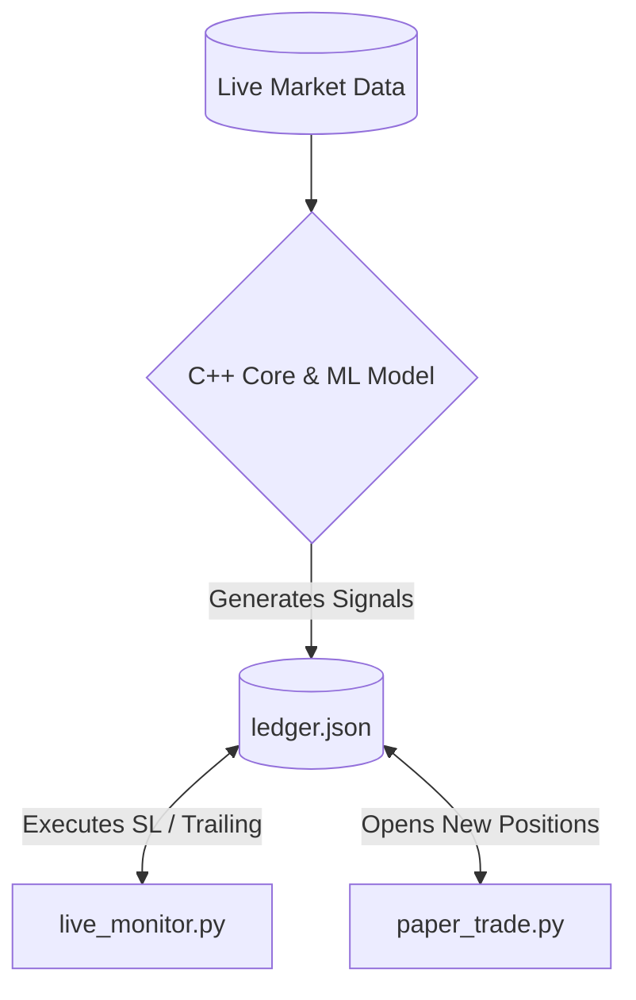
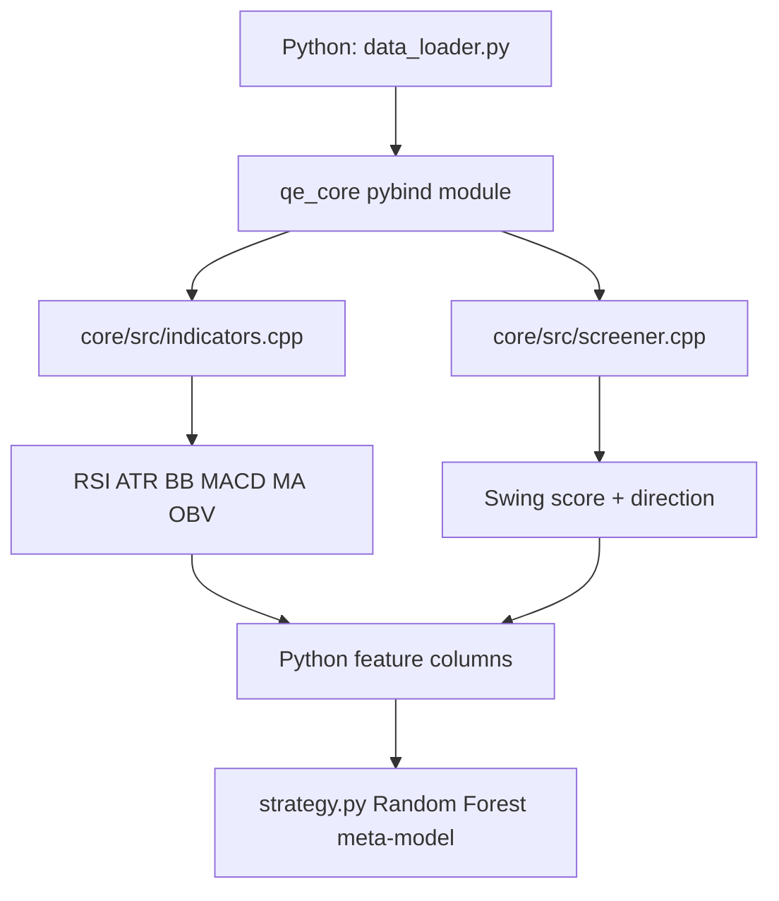

# QuantEngine

QuantEngine is a hybrid Python + C++ paper-trading research engine for NSE swing strategies.

It combines:
- A C++ indicator/screener core (via `pybind11`) for fast feature generation, including OBV.
- A Python ML stack with a primary signal and Random Forest meta-model filter.
- A two-script operational model:
  - `live_monitor.py` for intraday risk exits (SL/trailing).
  - `paper_trade.py` for end-of-day (EOD) position updates and new entries.

---

## Table of Contents

1. [Architecture Overview](#architecture-overview)
2. [Two-Script Workflow](#two-script-workflow)
3. [Model Design](#model-design)
4. [Data and Labels](#data-and-labels)
5. [Build the C++ Core (CMake)](#build-the-c-core-cmake)
6. [Environment Setup](#environment-setup)
7. [Runbook](#runbook)
8. [Angel One Feed Resilience (Phase 1)](#angel-one-feed-resilience-phase-1)
9. [Outputs and State Files](#outputs-and-state-files)
10. [Troubleshooting](#troubleshooting)
11. [Financial Disclaimer](#financial-disclaimer)

---

## Architecture Overview

### High-level system



### C++ + Python boundary



Why this split exists:
- Indicator-heavy numeric loops run in C++ for speed and deterministic behavior.
- ML orchestration, execution logic, and broker adapters remain in Python for flexibility.

---

## Two-Script Workflow

### Script 1: `live_monitor.py` (intraday execution/risk)

Purpose:
- Monitors only currently open positions during market hours.
- Applies intraday stop logic:
  - Stop Loss (including gap-through handling)
  - Trailing stop activation and trailing updates
- Writes exits back to `paper_trades/ledger.json`.

Window:
- Intended during NSE session (approx `09:15` to `15:30`).

Important:
- `live_monitor.py` does **not** generate new strategy entries.
- It is risk execution and monitoring only.

### Script 2: `paper_trade.py` (EOD signal generation)

Purpose:
- Updates all open positions with EOD OHLC context.
- Applies time-based exits (max hold days).
- Scans watchlist and opens new BUY trades when model conditions pass.
- Produces summary artifacts:
  - `paper_trades/ledger.json`
  - `paper_trades/portfolio.xlsx`

Window:
- Run after close-settlement buffer (configured default `15:45`) to avoid unsettled close data.

Important:
- This script is your strategy entry engine.
- Intraday execution protection is handled separately by `live_monitor.py`.

---

## Model Design

### 1) Primary signal
- Based on `CPP_score` quantiles:
  - top quartile -> `+1` (buy bias)
  - bottom quartile -> `-1` (sell bias)
  - middle -> `0` (no action)

### 2) Meta-model
- `RandomForestClassifier` filters the primary signal quality.
- Trained on whether primary direction matched triple-barrier outcome.
- Only keeps signals with `confidence >= META_CONFIDENCE`.

### 3) Feature set highlights
- Price/return features (`Return_5d`, MA ratios, volatility)
- Market context (`VIX`, Nifty return/MA)
- Regime features (`Regime_ok`)
- Technicals from C++ core:
  - RSI
  - ATR
  - Bollinger %
  - MACD histogram
  - MA trend
  - OBV ratio

### 4) Risk framing
- ATR-based stop loss.
- ATR-based trailing activation and dynamic trail raise.
- Max-hold time exit.
- Gap-aware stop execution (exit at open if gap-through).

---

## Data and Labels

### Sources
- Historical training/backtest: Yahoo (via `yfinance`) in `data_loader.py`.
- Live monitoring feed: configured in `broker_feed.py` using `PRICE_FEED`.

### Labeling
- Triple-barrier style directional labels over configurable swing horizon:
  - hit TP barrier -> `+1`
  - hit SL barrier -> `-1`
  - otherwise sign of horizon return

---

## Build the C++ Core (CMake)

The C++ extension module is `qe_core` and is required by `data_loader.py`.

### Prerequisites (macOS)
- Xcode Command Line Tools
- CMake >= 3.16
- Python 3.13 venv (or your chosen Python)
- `pybind11`

Example:

```bash
xcode-select --install
brew install cmake pybind11
```

### Build steps

From repo root:

```bash
mkdir -p build
cd build
cmake .. -Dpybind11_DIR=$(python3 -m pybind11 --cmakedir)
cmake --build . --config Release -j
cd ..
```

The build should produce a module like:
- `build/qe_core.cpython-*.so`

### Quick verification

```bash
.venv/bin/python -c "import sys, os; sys.path.insert(0, 'build'); import qe_core; print('qe_core OK')"
```

If `pybind11` is not found, pass explicit CMake hint for your system path or install path.

---

## Environment Setup

### 1) Create venv and install Python dependencies

```bash
python3 -m venv .venv
. .venv/bin/activate
pip install --upgrade pip
pip install -r requirements.txt
```

### 2) Configure secrets locally

```bash
cp .env.example .env
```

Populate `.env` with your broker credentials.

Notes:
- `.env` is ignored by git.
- `.env.example` is committed as template.
- `config.py` loads `.env` automatically when present.

### 3) Select price feed

In `.env`:

```bash
PRICE_FEED=angelone
```

Supported feed values:
- `yfinance`
- `angelone`
- `dhan`

---

## Runbook

### A) Intraday monitor

```bash
.venv/bin/python live_monitor.py
```

### B) EOD generation/update

```bash
.venv/bin/python paper_trade.py
```

Recommended sequence on trading days:
1. Start `live_monitor.py` after market open.
2. Run `paper_trade.py` after EOD safe time (default 15:45).

---

## Angel One Feed Resilience (Phase 1)

Current behavior in `broker_feed.py`:
- WebSocket-first design with reconnection loop.
- Immediate fallback to HTTP LTP when websocket is stale/down.
- Automatic failback to websocket after stable ticks.

Tunable knobs in `.env` (optional):

```bash
ANGELONE_WS_STALE_SECS=3
ANGELONE_WS_RECONNECT_MIN_SECS=1
ANGELONE_WS_RECONNECT_MAX_SECS=10
ANGELONE_WS_FAILBACK_TICKS=3
ANGELONE_WS_FALLBACK_DWELL_SECS=15
```

Operational interpretation:
- If websocket disconnects, monitor can still price via HTTP fallback.
- When websocket health recovers, mode switches back automatically.

---

## Outputs and State Files

Primary runtime artifacts:
- `paper_trades/ledger.json`: open/closed trades + capital state
- `paper_trades/portfolio.xlsx`: EOD summary workbook
- `paper_trades/*.log`: local runtime logs

These runtime files are intentionally local and excluded from git by `.gitignore`.

---

## Troubleshooting

### `ModuleNotFoundError: qe_core`
- Build C++ module with CMake steps above.
- Ensure scripts add `build/` to `sys.path` (already present in project scripts).

### Angel login succeeds but LTP fails with invalid token
- Ensure token mapping from Angel instrument master is available.
- Verify symbol format is NSE cash equity style (`SYMBOL-EQ`).

### Websocket appears connected but mode remains fallback
- Outside market hours this can happen due to low/no tick flow.
- During active hours, stable ticks should switch mode back to websocket primary.

### EOD run timing confusion
- Keep EOD strategy execution after settlement buffer (default 15:45), not exactly 15:30.

---

## Financial Disclaimer

This repository is for educational and research purposes only.

- It is **not** investment advice, portfolio advice, tax advice, legal advice, or a solicitation to buy/sell securities.
- Trading and investing involve substantial risk, including possible loss of principal.
- Past performance, backtests, and paper-trading outcomes do not guarantee future results.
- Market data may be delayed, incomplete, or temporarily unavailable.
- Broker APIs/websockets can fail, disconnect, throttle, or return inconsistent values.
- Any order/execution logic derived from this code is used entirely at your own risk.

By using this repository, you acknowledge that:
- You are solely responsible for validating strategy logic, risk controls, and compliance obligations.
- The authors/contributors are not liable for any financial losses, missed opportunities, data issues, operational failures, or consequential damages arising from use of this software.

Use strict risk management, run in paper mode first, and seek professional advice before deploying real capital.
